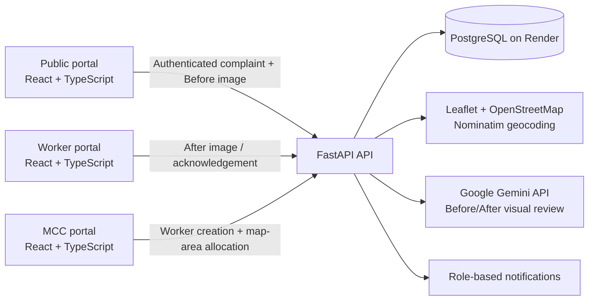
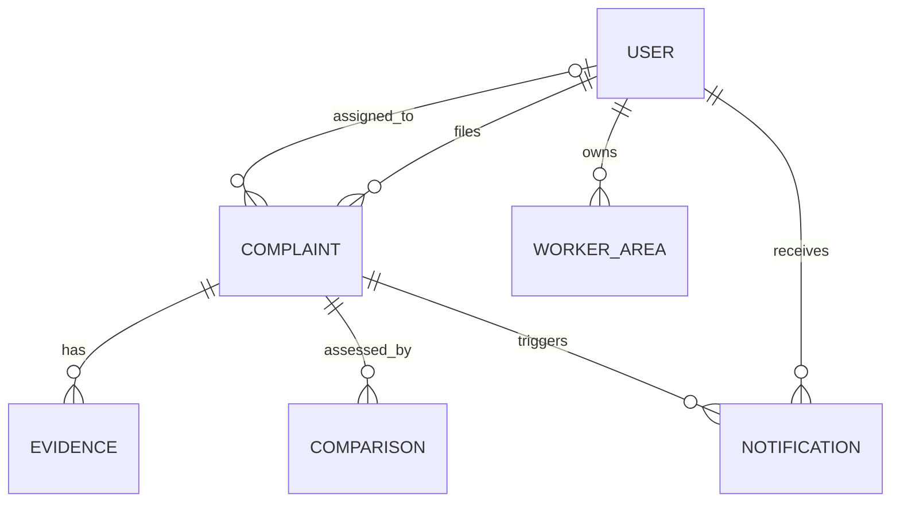

# Architecture

[← Back to README](../README.md)

## System Diagram

## Request Walkthrough

1. A signed-in public user selects an issue type, places a Mysuru map pin or uses device location, confirms the reverse-geocoded address, and submits a complaint with a Before image.
2. FastAPI stores the complaint and checks whether its latitude/longitude falls inside an MCC-created worker-area polygon.
3. A matching complaint is assigned to that worker; otherwise it remains `UNASSIGNED` for MCC. Saving a new area also routes older unassigned complaints inside that polygon.
4. The assigned worker acknowledges the work and uploads an After image. The API persists both evidence records and triggers Gemini assessment in the background.
5. Gemini receives the selected category plus Before/After images and returns a visual score, result, and explanation. The result and notification are available to the public user, worker, and MCC.

## Components

| Component | Responsibility | Tech | Code location |
|---|---|---|---|
| Public, worker, MCC portals | Role-specific sign-in, complaint reporting, evidence view, worker work queue, and MCC operations | React, TypeScript, Vite | `src/frontend/src/pages/` |
| Map and location picker | Map pin selection, device-location fallback, reverse-geocoded address, and worker-area drawing | Leaflet, OpenStreetMap, Nominatim | `src/frontend/src/components/` |
| REST API | Authentication, complaint/evidence access, role checks, dashboard data, uploads, and notifications | Python, FastAPI, Uvicorn | `src/backend/app/api/routes/` |
| Area routing | Point-in-polygon matching, overlap checks, worker-area creation/removal, and unassigned-complaint backfill | Python | `src/backend/app/api/routes/areas.py` |
| Data store | Users, complaints, areas, evidence, comparisons, and notifications | PostgreSQL, SQLAlchemy | `src/backend/app/db/` |
| Visual review | Gemini request, result parsing, scoring, and notification creation | Google Gemini API | `src/backend/app/services/verification_service.py` |

## Data Model

| Entity | Key fields | Notes |
|---|---|---|
| `User` | `id`, `name`, `email`, `role`, `service_area` | Roles are `PUBLIC`, `WORKER`, and `ADMIN` (MCC). |
| `Complaint` | `complaint_number`, `issue_type`, `latitude`, `longitude`, `address`, `status`, `created_by`, `assigned_worker_id` | Stores the selected location and workflow state. |
| `WorkerArea` | `worker_id`, `name`, `polygon_json` | One MCC-drawn, non-overlapping polygon per worker. |
| `Evidence` | `complaint_id`, `type`, `file_data`, `mime_type`, `quality_score` | `BEFORE` is public evidence; `AFTER` is worker evidence. |
| `Comparison` | `complaint_id`, `overall_evidence_score`, `result`, `explanation` | Latest Gemini visual-assessment outcome. |
| `Notification` | `user_id`, `complaint_id`, `kind`, `message` | Notifies a public user of high-scoring resolution or a worker when clearer work/evidence is needed. |

## Key APIs

| Method | Endpoint | Purpose | Auth |
|---|---|---|---|
| `POST` | `/api/v1/auth/signup` | Create a public account | Public |
| `POST` | `/api/v1/auth/login` | Sign in a public user, worker, or MCC administrator | Public |
| `POST` | `/api/v1/complaints/` | Create a location-based complaint | Public user supported |
| `POST` | `/api/v1/complaints/{id}/evidence` | Upload Before or After evidence with role validation | Public/worker token |
| `GET` | `/api/v1/complaints/worker/inbox` | Get the signed-in worker's assigned complaints | Worker token |
| `POST` | `/api/v1/areas/` | Save a worker area and backfill matching unassigned reports | MCC administrator token |
| `GET` | `/api/v1/complaints/{id}/portal` | Get authorised public/worker complaint detail and AI result | Public/worker token |
| `GET` | `/api/v1/complaints/dashboard` | Get MCC live complaint and verification summary | MCC administrator token |

## Tech Stack

| Layer | Choice | Why this over alternatives |
|---|---|---|
| Frontend | React, TypeScript, Vite | Fast iteration with typed role-specific UI. |
| Maps | Leaflet, OpenStreetMap, Nominatim | Lightweight interactive map and address lookup without a proprietary map SDK. |
| Backend | FastAPI, Python, Uvicorn | Async-friendly API with straightforward file upload and validation support. |
| Database | PostgreSQL on Render, SQLAlchemy | Persistent relational storage for users, evidence metadata, areas, and outcomes. |
| ML / AI | Google Gemini API | Visual Before/After and category assessment without training a custom model. |
| Hosting | Vercel frontend; Render FastAPI backend and PostgreSQL | Simple independent deployment of static frontend and API/database services. |

## Data Sources

| Dataset / service | Source & licence | Real or synthetic | Used for |
|---|---|---|---|
| Basemap tiles | OpenStreetMap contributors | Live third-party map data | Visual Mysuru map and complaint/area display. |
| Reverse geocoding | OpenStreetMap Nominatim | Live third-party service | Fill an address after a map point or device location is selected. |
| Worker-area polygons | Created by MCC administrator in the app | Application data | Route complaints to a worker; not official MCC/KGIS boundary data. |
